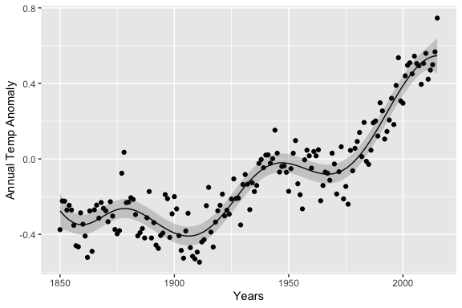
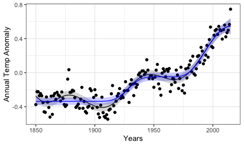

<!-- README.md is generated from README.Rmd. Please edit that file -->

# bayeslinear

<!-- badges: start -->
<!-- badges: end -->

<tt>bayeslinear</tt> provides tools to perform a Bayes Linear analysis.

## Installation

<tt>bayeslinear</tt> is currently in development; install the latest
version from [GitHub](https://github.com/) with:

``` r
install.packages("devtools")
devtools::install_github("astfalckl/bayeslinear")
```

# Vanilla Bayes Linear Analysis

## Creating Belief Structures

A belief structure is the fundamental unit of information that we
require to conduct a BL analysis blah blah blah. It requires the
specification of 𝔼(*X*), 𝔼(*D*), var(*X*), var(*D*) and cov(*X*,*D*) to
fully specify the inner product space. The methods in
<tt>bayeslinear</tt> are based on the creation of a belief structure
object through <tt>bs()</tt>. For example the one-dimensional example in
Goldstein and Wooff (2007) is created as

``` r
library(bayeslinear)
library(ggplot2)
library(CVXR)
library(dplyr)

theme_set(theme_bw())
```

``` r
E_X <- 1
E_D <- 2

var_X <- var_D <- 1
cov_XD <- 0.6

one_dimension <- bs(E_X, E_D, cov_XD, var_X, var_D)
print(one_dimension)
#> List of 5
#>  $ E_X   : num [1, 1] 1
#>  $ E_D   : num [1, 1] 2
#>  $ cov_XD: num [1, 1] 0.6
#>  $ var_X : num [1, 1] 1
#>  $ var_D : num [1, 1] 1
#>  - attr(*, "class")= chr "bs"
#>  - attr(*, "nx")= int 1
#>  - attr(*, "nd")= int 1
```

## Adjusting Belief Structures

A <tt>bs</tt> object is adjusted by some data <tt>D</tt> via the
<tt>adjust</tt> method. An adjusted belief structure <tt>adj_bs</tt> is
returned.

``` r
D <- 0
adjust(one_dimension, D)
#> List of 5
#>  $ E_adj  : num [1, 1] -0.2
#>  $ var_adj: num [1, 1] 0.64
#>  $ Rvar   : num [1, 1] 0.36
#>  $ D      : num [1, 1] 0
#>  $ prior  :List of 5
#>   ..$ E_X   : num [1, 1] 1
#>   ..$ E_D   : num [1, 1] 2
#>   ..$ cov_XD: num [1, 1] 0.6
#>   ..$ var_X : num [1, 1] 1
#>   ..$ var_D : num [1, 1] 1
#>   ..- attr(*, "class")= chr "bs"
#>   ..- attr(*, "nx")= int 1
#>   ..- attr(*, "nd")= int 1
#>  - attr(*, "class")= chr "adj_bs"
#>  - attr(*, "nx")= int 1
#>  - attr(*, "nd")= int 1
```

## Summaries of Adjusted Belief Structures

Methods for calculating the adjustment resolutions and performing a
canonical analysis on either a <tt>bs</tt> or an <tt>adj_bs</tt> object
are <tt>resolution</tt> and <tt>canonical</tt>. For example, calculated
on the oral glucose data (this belief structure ships with the package).
Note, we don’t have to observe the adjustment to calculate the
resolutions and canonical directions; they are a product of our prior
beliefs.

``` r
# Note: resolution is masked in ggplot2 so we have to explicitly call it from bayeslinear here
bayeslinear::resolution(oral_glucose)
#> [1] 0.3108514 0.0448334
canonical(oral_glucose)
#> $resolutions
#> [1] 0.31842089 0.02017772
#> 
#> $resolution_matrix
#>             [,1]        [,2]
#> [1,]  0.33360455 0.134457797
#> [2,] -0.03539375 0.004994056
#> 
#> $directions
#>            [,1]       [,2]
#> [1,]  1.0058635 -0.3019600
#> [2,] -0.1135872  0.7038817
#> 
#> $directions_prior
#>           [,1]
#> [1,] -3.474472
#> [2,] -3.143107
#> 
#> $system_resolution
#> [1] 0.1692993
```

# Generalised Bayes Linear Analysis

## Defining and adjusting a GBL Belief Structure

A GBL belief structure (<tt>gbl_bs</tt>) is constructed similarly to a
standard belief structure object with the addition of a
<tt>constraint</tt> argument that defines the solution space 𝒞.
<tt>bayeslinear</tt> assumes 𝒞 is convex and uses <tt>CVXR</tt> to
efficiently calculate the projection into 𝒞. Consider the completely
arbitrary example below.

``` r
nx <- 2
nd <- 1

E_X <- matrix(c(0,0))
E_D <- matrix(c(0))
var_X <- matrix(c(0.6, 0.3, 0.3, 0.6), nrow = nx)
cov_XD <- matrix(c(0.4, -0.1), nrow = nx)
var_D <- matrix(c(1), nrow = nd)

gbl_bivar <- gbl_bs(
  E_X, E_D, cov_XD, var_X, var_D, 
  quote(list(Ec_adj >= 0))
)
gbl_bivar
#> List of 6
#>  $ E_X       : num [1:2, 1] 0 0
#>  $ E_D       : num [1, 1] 0
#>  $ cov_XD    : num [1:2, 1] 0.4 -0.1
#>  $ var_X     : num [1:2, 1:2] 0.6 0.3 0.3 0.6
#>  $ var_D     : num [1, 1] 1
#>  $ constraint: language list(Ec_adj >= 0)
#>  - attr(*, "class")= chr "gbl_bs"
#>  - attr(*, "nx")= int 2
#>  - attr(*, "nd")= int 1
```

Note the <tt>constraint</tt> argument is an expression being passed
through to <tt>CVXR</tt> and so must be wrapped in <tt>quote()</tt>.
Adjusting a <tt>gbl_bs</tt> object is the same as for vanilla Bayes
linear with a few extra outputs.

``` r
D <- c(-3)
bivar_adjust <- adjust(gbl_bivar, D)
bivar_adjust
#> List of 5
#>  $ Ec_adj  : num [1:2, 1] -1.38e-21 1.23
#>  $ varc_adj: num [1:2, 1:2] 0.0241 0.0186 0.0186 0.3417
#>  $ D       : num [1, 1] -3
#>  $ E_adj   : num [1:2, 1] -1.2 0.3
#>  $ var_adj : num [1:2, 1:2] 0.44 0.34 0.34 0.59
#>  - attr(*, "class")= chr "adj_gbl_bs"
#>  - attr(*, "status")= chr "optimal"
#>  - attr(*, "nx")= int 2
#>  - attr(*, "nd")= int 1
```

## Example - Monotone Regression

We demonstrate a GBL analysis with the <tt>cdiac</tt> data that ships
with <tt>CVXR</tt>. The data contains Global Monthly and Annual
Temperature Anomalies (degrees C, relative to the 1961-1990 mean) for
years 1850-2015. This is plotted below.


A traditional Bayes linear analysis would specify some prior belief
structure and adjust by the data. For example

``` r
n <- nrow(cdiac)
x <- cdiac$year

E_X <- E_D <- matrix(rep(0,n))

var_X <- cov_XD <- 0.3^2 * exp(-(as.matrix(dist(x))/25)^2) + 1e-6 * diag(rep(1, n))
var_D <- var_X + 0.1^2 * diag(rep(1, n))

bivar <- bs(E_X, E_D, cov_XD, var_X, var_D)

D <- cdiac$annual
temp_adjust <- adjust(bivar, D)
```

The result of this adjustment is shown below.



We can enforce the prior belief that this data is monotone increasing by
specifying a <tt>gbl_bs</tt> object and adjusting by the data.

``` r
gbl_bivar <- gbl_bs(
  E_X, E_D, cov_XD, var_X, var_D, 
  quote(list(CVXR::diff(Ec_adj) >= 0))
)

temp_const_adjust <- adjust(gbl_bivar, D)
```

The GBL inference is shown in blue.



### The boring stuff

``` r
sessionInfo()
#> R version 3.6.1 (2019-07-05)
#> Platform: x86_64-apple-darwin15.6.0 (64-bit)
#> Running under: macOS Mojave 10.14.6
#> 
#> Matrix products: default
#> BLAS:   /Library/Frameworks/R.framework/Versions/3.6/Resources/lib/libRblas.0.dylib
#> LAPACK: /Library/Frameworks/R.framework/Versions/3.6/Resources/lib/libRlapack.dylib
#> 
#> locale:
#> [1] en_AU.UTF-8/en_AU.UTF-8/en_AU.UTF-8/C/en_AU.UTF-8/en_AU.UTF-8
#> 
#> attached base packages:
#> [1] stats     graphics  grDevices utils     datasets  methods   base     
#> 
#> other attached packages:
#> [1] dplyr_1.0.7            CVXR_1.0-9             ggplot2_3.3.5         
#> [4] bayeslinear_0.0.0.9000
#> 
#> loaded via a namespace (and not attached):
#>  [1] gmp_0.6-2        Rcpp_1.0.7       pillar_1.6.4     compiler_3.6.1  
#>  [5] tools_3.6.1      bit_1.1-14       digest_0.6.28    lattice_0.20-38 
#>  [9] evaluate_0.14    lifecycle_1.0.1  tibble_3.1.6     gtable_0.3.0    
#> [13] pkgconfig_2.0.3  rlang_0.4.12     Matrix_1.2-18    DBI_1.1.0       
#> [17] yaml_2.2.0       xfun_0.12        osqp_0.6.0.3     Rmpfr_0.8-2     
#> [21] withr_2.4.2      stringr_1.4.0    knitr_1.27       generics_0.1.1  
#> [25] vctrs_0.3.8      bit64_0.9-7      grid_3.6.1       tidyselect_1.1.1
#> [29] glue_1.5.0       R6_2.5.1         fansi_0.5.0      rmarkdown_2.1   
#> [33] farver_2.1.0     purrr_0.3.4      magrittr_2.0.1   MASS_7.3-51.4   
#> [37] scales_1.1.1     ellipsis_0.3.2   htmltools_0.4.0  assertthat_0.2.1
#> [41] colorspace_2.0-2 labeling_0.4.2   utf8_1.2.2       stringi_1.4.3   
#> [45] munsell_0.5.0    crayon_1.4.2
```
