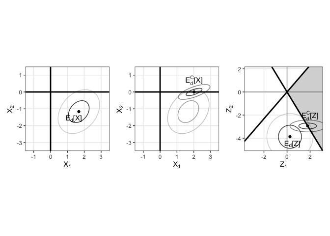

<!-- README.md is generated from README.Rmd. Please edit that file -->

# bayeslinear

<!-- badges: start -->
<!-- badges: end -->

<tt>bayeslinear</tt> provides tools to perform a Bayes Linear analysis
as well as generalising the solution space to convex subsets. For
overview of these methodologies see HERE.

## Installation

<tt>bayeslinear</tt> is currently in development; install the latest
version from [GitHub](https://github.com/) with:

``` r
install.packages("devtools")
devtools::install_github("astfalckl/bayeslinear")
```

Also, call in some other packages we need for the README

``` r
library(bayeslinear)
library(ggplot2)
library(CVXR)
library(dplyr)
library(patchwork)
library(latex2exp)

theme_set(theme_bw())
```

# Standard and Generalised Bayes Linear Analysis

We demonstrate the code by repeating the example given in PAPER.

## Creating Belief Structures

A belief structure is the fundamental unit of information that specifies
the geometry of a Bayes linear analysis. We are required to specify
$\mathbb{E}(X)$, $\mathbb{E}(D)$, $\mathrm{var}(X)$, $\mathrm{var}(D)$
and $\mathrm{cov}(X,D)$. The methods in <tt>bayeslinear</tt> are based
on the creation of a belief structure object through the function
<tt>belief_structure()</tt>.

``` r
nx <- 2
nd <- 2

exp_x <- matrix(c(1, 1))
exp_d <- matrix(c(1, 1))
var_x <- matrix(c(0.54, 0.09, 0.09, 0.54), nrow = nx)
cov_xd <- matrix(c(0.4, -0.1, -.1, -.3), nrow = nx)
var_d <- matrix(c(1, -0.2, -0.2, 1), nrow = nd)

bivariate_bs <- belief_structure(exp_x, exp_d, cov_xd, var_x, var_d)
bivariate_bs
#> List of 5
#>  $ exp_x : num [1:2, 1] 1 1
#>  $ exp_d : num [1:2, 1] 1 1
#>  $ cov_xd: num [1:2, 1:2] 0.4 -0.1 -0.1 -0.3
#>  $ var_x : num [1:2, 1:2] 0.54 0.09 0.09 0.54
#>  $ var_d : num [1:2, 1:2] 1 -0.2 -0.2 1
#>  - attr(*, "class")= chr "belief_structure"
#>  - attr(*, "nx")= int 2
#>  - attr(*, "nd")= int 2
```

## Adjusting Belief Structures

A <tt>belief_structure</tt> object is adjusted by some data <tt>d</tt>
via the <tt>adjust</tt> method. An adjusted belief structure
<tt>adj_belief_structure</tt> is returned. Note that the initial belief
structure is always stored in <tt>prior_bs</tt>.

``` r
d <- c(3, 6.5)
bivariate_adj_bs <- adjust(bivariate_bs, d)
bivariate_adj_bs
#> List of 5
#>  $ adj_exp     : num [1:2, 1] 1.68 -1.17
#>  $ adj_var     : num [1:2, 1:2] 0.38 0.123 0.123 0.423
#>  $ resolved_var: num [1:2, 1:2] 0.1604 -0.0333 -0.0333 0.1167
#>  $ d           : num [1:2, 1] 3 6.5
#>  $ prior_bs    :List of 5
#>   ..$ exp_x : num [1:2, 1] 1 1
#>   ..$ exp_d : num [1:2, 1] 1 1
#>   ..$ cov_xd: num [1:2, 1:2] 0.4 -0.1 -0.1 -0.3
#>   ..$ var_x : num [1:2, 1:2] 0.54 0.09 0.09 0.54
#>   ..$ var_d : num [1:2, 1:2] 1 -0.2 -0.2 1
#>   ..- attr(*, "class")= chr "belief_structure"
#>   ..- attr(*, "nx")= int 2
#>   ..- attr(*, "nd")= int 2
#>  - attr(*, "class")= chr "adj_belief_structure"
#>  - attr(*, "nx")= int 2
#>  - attr(*, "nd")= int 2
```

## Creating Generalised Belief Structures

We may augment a belief structure with a solution constraint by using
the <tt>gen_belief_structure</tt> method. This is similar to above
however with the inclusion of a quoted constraint that gets passed to
<tt>CVXR</tt>. We demonstrate what some of these constraints look like
here, and point towards [here](https://cvxr.rbind.io) for a
comprehensive list of examples.

``` r
bivariate_gbs <- gen_belief_structure(
  exp_x, exp_d, cov_xd, var_x, var_d,
  quote(list(gen_adj_exp >= 0))
)
bivariate_gbs
#> List of 6
#>  $ exp_x     : num [1:2, 1] 1 1
#>  $ exp_d     : num [1:2, 1] 1 1
#>  $ cov_xd    : num [1:2, 1:2] 0.4 -0.1 -0.1 -0.3
#>  $ var_x     : num [1:2, 1:2] 0.54 0.09 0.09 0.54
#>  $ var_d     : num [1:2, 1:2] 1 -0.2 -0.2 1
#>  $ constraint: language list(gen_adj_exp >= 0)
#>  - attr(*, "class")= chr "gen_belief_structure"
#>  - attr(*, "nx")= int 2
#>  - attr(*, "nd")= int 2
```

## Adjusting Generalised Belief Structures

This happens with the same <tt>adjust</tt> method as before, but returns
the generalised adjusted expectation and variance according to the
specified constraint.

``` r
bivariate_adj_gbs <- adjust(bivariate_gbs, d)
#> CVXR returned with status: optimal
bivariate_adj_gbs
#> List of 5
#>  $ gen_adj_exp: num [1:2, 1] 2.02 -2.18e-21
#>  $ gen_adj_var: num [1:2, 1:2] 0.2231 0.0725 0.0725 0.0486
#>  $ d          : num [1:2, 1] 3 6.5
#>  $ adj_exp    : num [1:2, 1] 1.68 -1.17
#>  $ adj_var    : num [1:2, 1:2] 0.38 0.123 0.123 0.423
#>  - attr(*, "class")= chr "adj_gen_belief_structure"
#>  - attr(*, "CVXR_status")= chr "optimal"
#>  - attr(*, "nx")= int 2
#>  - attr(*, "nd")= int 2
```

## Plotting the results

We recreate Figure 1 from PAPER using the results above. We note that
<tt>ggplot</tt> has a habit of being very verbose, and so we have hidden
the code from the displayed <tt>README</tt> on GitHub. Please consult
the source file for all plotting code used.



# Example - Monotone Regression

We provide a further example with the <tt>cdiac</tt> data that ships
with <tt>CVXR</tt>. The data contains Global Monthly and Annual
Temperature Anomalies (degrees C, relative to the 1961-1990 mean) for
years 1850-2015. This is plotted below.


A traditional Bayes linear analysis would specify some prior belief
structure and adjust by the data. For example

``` r
n <- nrow(cdiac)
x <- cdiac$year

dist_mat <- as.matrix(dist(x))

exp_x <- exp_d <- matrix(rep(0, n))

var_x <- 0.3^2 * exp(-(dist_mat / 25)^2) + 1e-6 * diag(rep(1, n))
cov_xd <- 0.3^2 * exp(-(dist_mat / 25)^2) + 1e-6 * diag(rep(1, n))
var_d <- var_x + 0.1^2 * diag(rep(1, n))

monotone <- belief_structure(exp_x, exp_d, cov_xd, var_x, var_d)

d <- cdiac$annual

monotone_adj <- adjust(monotone, d)
```

The result of this adjustment is shown in the left figure, below. We may
wish to enforce the belief that the temperatures are monotonically
increasing, as a response to monotonic changes in the anthromorphic
forcings. We do this as shown.

``` r
monotone_gbs <- gen_belief_structure(
  exp_x, exp_d, cov_xd, var_x, var_d,
  quote(list(CVXR::diff(gen_adj_exp) >= 0))
)

monotone_gen_adj <- adjust(monotone_gbs, d)
#> CVXR returned with status: optimal
```

This result is shown on the right figure. As before, the plotting code
is suppressed, consult the source files if this interests you.


### The boring stuff

``` r
sessionInfo()
#> R version 4.3.0 (2023-04-21)
#> Platform: aarch64-apple-darwin20 (64-bit)
#> Running under: macOS 14.1.2
#> 
#> Matrix products: default
#> BLAS:   /Library/Frameworks/R.framework/Versions/4.3-arm64/Resources/lib/libRblas.0.dylib 
#> LAPACK: /Library/Frameworks/R.framework/Versions/4.3-arm64/Resources/lib/libRlapack.dylib;  LAPACK version 3.11.0
#> 
#> locale:
#> [1] en_US.UTF-8/en_US.UTF-8/en_US.UTF-8/C/en_US.UTF-8/en_US.UTF-8
#> 
#> time zone: Australia/Perth
#> tzcode source: internal
#> 
#> attached base packages:
#> [1] stats     graphics  grDevices utils     datasets  methods   base     
#> 
#> other attached packages:
#> [1] latex2exp_0.9.6        patchwork_1.1.3        dplyr_1.1.3           
#> [4] CVXR_1.0-11            ggplot2_3.4.2          bayeslinear_0.0.0.9000
#> 
#> loaded via a namespace (and not attached):
#>  [1] Matrix_1.6-1.1   bit_4.0.5        gtable_0.3.3     highr_0.10      
#>  [5] Rmpfr_0.9-3      compiler_4.3.0   tidyselect_1.2.0 Rcpp_1.0.10     
#>  [9] stringr_1.5.0    scales_1.2.1     yaml_2.3.7       fastmap_1.1.1   
#> [13] lattice_0.21-8   R6_2.5.1         labeling_0.4.3   generics_0.1.3  
#> [17] knitr_1.43       MASS_7.3-58.4    tibble_3.2.1     osqp_0.6.3.1    
#> [21] munsell_0.5.0    pillar_1.9.0     rlang_1.1.2      utf8_1.2.4      
#> [25] stringi_1.7.12   xfun_0.39        bit64_4.0.5      cli_3.6.1       
#> [29] withr_2.5.2      magrittr_2.0.3   digest_0.6.31    grid_4.3.0      
#> [33] gmp_0.7-2        lifecycle_1.0.4  vctrs_0.6.4      evaluate_0.21   
#> [37] glue_1.6.2       farver_2.1.1     fansi_1.0.5      colorspace_2.1-0
#> [41] rmarkdown_2.22   tools_4.3.0      pkgconfig_2.0.3  htmltools_0.5.5
```
